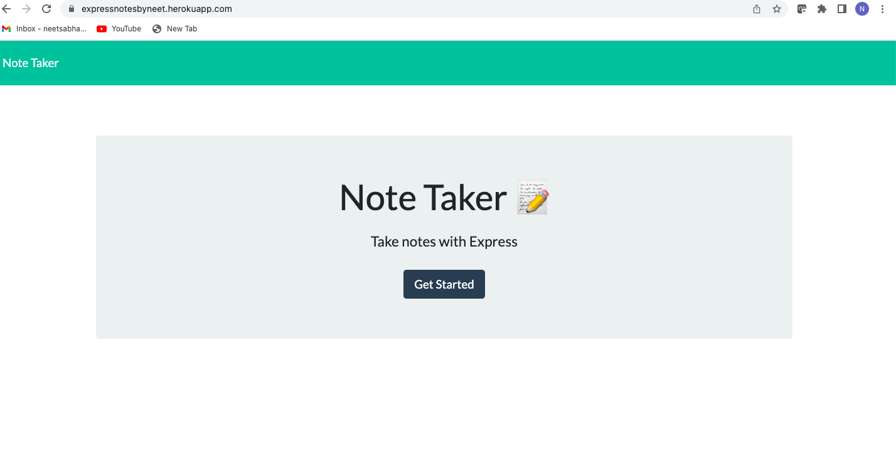

# Note Taker App

An application that can be used to write and save notes.

## Licensing
  

## Table of Contents
  - [Description](#description)
  - [Installation](#installation)
  - [Usage](#usage)
  - [Contribution](#contribution)
  - [Testing](#testing)
  - [Additional Info](#additional-info)

## Description:
  This app allows users to get, post and delete notes. 
  
## Deployed on HEROKU
  https://expressnotesbyneet.herokuapp.com/notes
  
## Screenshots:

## Video Walkthrough:

## Installation:
  App uses NODE.JS, EXPRESS.JS, and UNIQID or do 'npm i' through the command line to install the necessary packages. 
  Execute 'node server' and app should run on PORT 3001.

## Usage:
  To be used for taking notes. See all notes, create new or delete an existing one.

## License:
  None

## Contribution:
  None

## Testing:
  Tested thoroughly in develompment environment and smoke tested post deployment to heroku.
  Try it - https://expressnotesbyneet.herokuapp.com/
  
## Additional Info:
  - Github: [neetsabharwal](https://github.com/neetsabharwal)